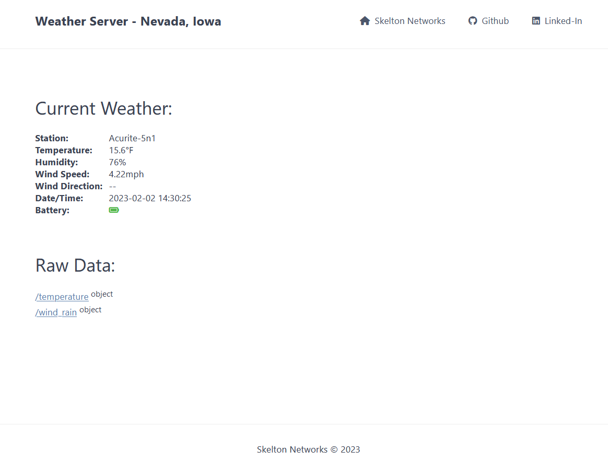

# Weather Reporter

### Purpose:

Read Data from 5-in-1 Accurite Weather Station to the web.

### Methodology:

1. Pull Data from SDR (2 minute run with [rtl_433](https://github.com/merbanan/rtl_433))
2. Data is read in, formatted, and placed in db.json.
3. [json-server](https://www.npmjs.com/package/json-server) reads and outputs data from db.json.

### Timing:

| Task | Time |
| ---- | ---- |
| SDR Data Pull | Hourly |
| Read SDR Data | Every 10 Minutes |
| Write to db.json | Every 10 Minutes |

### Web Page:

[]